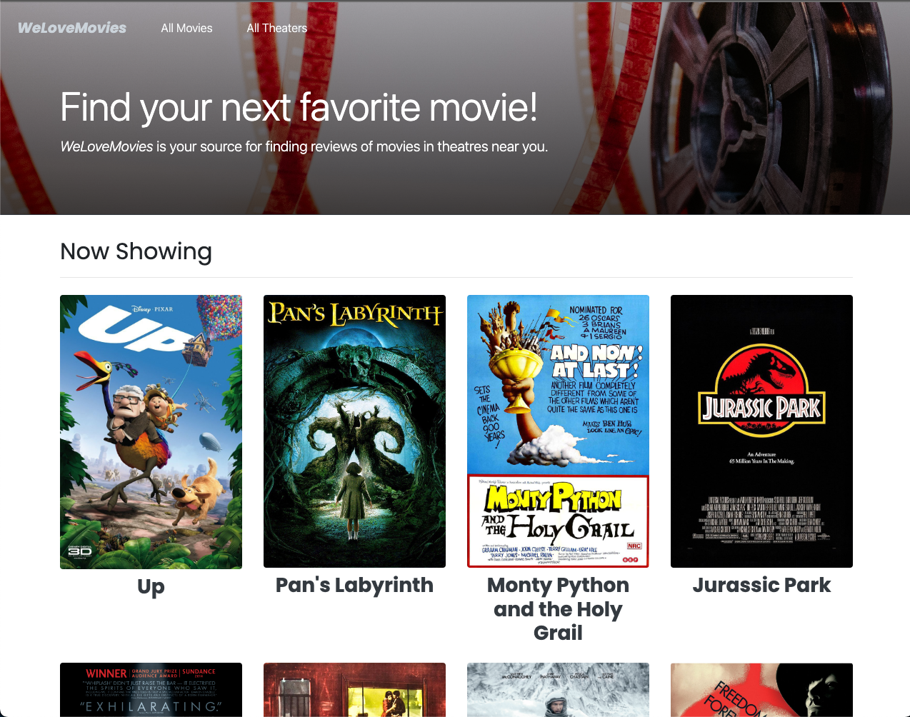

# Project: WeLoveMovies


## Index
1. [Live Application](Live-Frontend-and-Backend-Application)
2. [Project Objective and Tasks](#project-goals)
3. [Setup and Deployment Guide](#setup-and-deployment-guide)
4. [Project Links](#project-links)

## Live Frontend and Backend Application 
Follow this link to the live [WeLoveMovies](https://frontendwelovemovies.onrender.com/) Application on Render.

Below is the guide for the install and setup of this project, you can follow it and get your own server running on render. 

## Overview/ Instruction for Building Project

This shows the steps required to build this backend project, you can skip to the [Setup and Deployment Guide](#setup-and-deployment-guide).

Welcome to the WeLoveMovies project! As a backend developer, your role is to set up a database and create specific routes that will provide users with access to data about movies, theaters, and reviews. This project challenges your skills in building complex servers, working with databases, and following RESTful design principles.

## Project Goals

In this project, you will demonstrate your ability to:

- Install and use common middleware packages.
- Handle requests through routes.
- Run tests from the command line.
- Access relevant information through route and query parameters.
- Create an error handler for non-existing routes.
- Build an API following RESTful design principles.
- Customize a `knexfile.js` file.
- Establish a database connection with Knex.
- Write database queries for CRUD routes in an Express server.
- Retrieve joined and nested data using Knex.
- Create database migrations using Knex's migration tools.
- Deploy the backend server to a cloud service.


## Goal

Your tasks involve setting up the database and creating routes for the frontend application. Start by making changes to the data tier and then proceed with changes to the application tier using an inside-out development workflow. Detailed information about each table and route is provided in the project documentation.

### Database Tables

- Create five tables for this project. Refer to the `docs/tables/` folder for detailed table information.
- Generate migrations for each table and run these migrations.
- Seed data is included in the `./src/db/seeds` folder. Seeds will run correctly if tables are set up as described in previous documents.

### Routes

- Implement five routes for the project. Refer to the `docs/routes/` folder for detailed route information. Note that certain routes return data based on query parameters.

### General Tasks

Ensure the following tasks are complete:

- `app.js` and `server.js` files are correctly configured, with `app.js` exporting the Express application.
- Utilize the `cors` package to allow frontend requests to reach the backend.
- Return a 404 error for requests to non-existing routes.
- Return a 405 error for requests to existing routes with incorrect HTTP methods.
- All routes should respond with appropriate status codes and use a `data` key in the response.

## Additional Notes

Review the Rubric Requirements for the human-graded part of this project in your Thinkful curriculum page. Deployment of the application (backend and frontend) on Render is required.


## Setup and Deployment Guide

Follow these steps to set up and deploy the WeLoveMovies project on your local machine and on the Render platform.

### 1. Fork the Repository

1. Fork the WeLoveMovies repository on GitHub to your own GitHub account.

### 2. Install Dependencies

1. Clone the forked repository to your local machine.
2. Open your terminal and navigate to the project directory.
3. Run the following command to install project dependencies:

 ```sh
   npm install
   ```

### 3. Set Up Database and Migrations

1. Make sure Knex is installed globally. If not, you can install it using:


 ```sh
   npm install -g knex
   ```

2. Create a `.env` file in the root directory of the project. Add the following line, replacing `<YOUR_DATABASE_URL>` with your actual ElephantSQL database URL: DATABASE_URL=<YOUR_DATABASE_URL>


3. Run the migration command to set up the database tables:

 ```sh
   npx knex migrate:latest
   ```


4. Seed the database with initial data:
```sh
  npx knex seed:run
  ```


### 4. Deploy Backend on Render

1. Create an account on Render (if you don't have one).
2. Log in to Render and click "Add a New Web Service."
3. Choose a name for your backend service.
4. For the "Build Command," use:

```sh
  node src/server.js
  ```

6. Add an environmental variable with the key `DATABASE_URL` and the value as your ElephantSQL database URL.

7. Deploy the service.

### 5. Connect Backend and Frontend on Render

1. Follow the link provided above to access the frontend repository.

2. Create a `.env.production` file in the frontend project's root directory.

3. Add the following line to the `.env.production` file, replacing `<BACKEND_RENDER_URL>` with the URL of your backend service on Render: REACT_APP_API_URL=<BACKEND_RENDER_URL>

4. Navigate to `src/utils/api.js` in the frontend project.

5. Replace the value of `API_BASE_URL` with your backend Render URL:
const API_BASE_URL = "<BACKEND_RENDER_URL>";


### 6. Deploy Frontend on Render

1. Go back to your Render account dashboard.
2. Click "Add a New Web Service" again.
3. Choose a name for your frontend service.
4. For the "Build Command," use:

```sh
  npm install
  ```
5. For the "Start Command," use:

```sh
  npm start
  ```

6. Deploy the Service.

# Project Links

- **Frontend Render:** [Render](https://frontendwelovemovies.onrender.com/)
  This is the deployed frontend connected to the backend.

- **Backend Render:** [Render](https://backendwelovemovies.onrender.com/)
  This is the deployed backend.

- **Frontend GitHub Repository:** [GitHub](https://github.com/MangakingO/starter-movie-front-end)
  This is the link to the GitHub repository for the frontend code.
